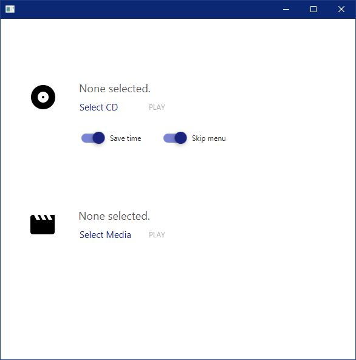

# WXPlayer (Windows 10 Player)
Windows media player written in JavaFX. Designed *primarily* for CD's.

### Important Information
All the libraries and frameworks used herein are open source and available on GitHub as projects. Aside from JavaFX, 
I used the following two projects in mine: JFoenix and VLCJ 4.0. I have provided all the licensing information at the bottom
of this page, and here I link both the websites and GitHub repositories for the named projects.
* JFoenix
  - http://jfoenix.com/
  - https://github.com/jfoenixadmin/JFoenix
* VLCJ 4.0
  - http://capricasoftware.co.uk/projects/vlcj
  - https://github.com/caprica/vlcj
  
It's worth mentioning that without Caprica's example code on rendering the canvas in JavaFX, this project wouldn't have been possible.

### Purpose
Windows is known, at least from my perspective, not to have a CD player any longer. As a result, I decided to try and create my own using
the tools I currently have available. As this was a project for myself, the code is rather unorganized and has a heavy experimentation
with multithreading and concurrency (due in part to the media component).

Nonetheless, it serves it's purpose with minor and rare bugs and plays CD's (so mission accomplished!). 

### Known Issues
There are a few known issues that either come as rare bugs, or I had a rough time fixing likely because of some JavaFX limitations
that I was unable/didn't have the knowledge to circumvent.
* On occasion the app will crash when pushing to the video view due to the VLCJ release. This doesn't happen often, so it's not much cause for concern.
* Because there's a heavy use of the ```Platform.runlater(...)``` and I'm putting most updates to the UI to be executed later, a rare bug occurs where some components begin blinking white on window resize.
* "Save time" feature purposely unimplemented (in the code anyway) as the video view would not load with it as such.
* When loading anything that is not a CD (i.e. other media), the aspect ratio button does not work. However, I purposely disregarded the stop button and menu button when it came to other media, hence you won't see the stop button and the menu button does not work.
* Either this bug occurs with solely other media or resolutions higher than your own, but the scaling magic somewhat breaks as a result. All the movies I tested the app with worked perfectly but note that their resolutions were almost always 720x480. You'll see this error in the screenshots below.
* Progress bar has a *semi* hardcoded size. Although it has a dynamic calculation, it does use a "magic number" to scale it. A proposed solution is to take the size of the time label and the size of the stage and subtract the two, making that the progress bar's max size instead. 


### Additional notes
When it came to implementing the other media feature, a lot of the components for the media have purposely been unimplemented. For example, you'll notice the menu option remains even when not playing a CD. This is because I left it as such.

**Development status:** Now finished. The main purpose of the app was implemented, as far as I can tell, completely. 

### Screenshots: CD Player - Fullscreen and default media resolution

</img>
</img>
</img>
</img>


### Screenshots: Other media - Fullscreen and default media resoltuion

</img>
</img>

### Screenshots: Main menu

</img>

### Licenses and legal information
JFoenix License - Utilizes the Apache license
VLCJ 4.0 License - Utilizes the GNU GPL licence v3. 

Note that my project also uses GNU GPL.

See the repo for details.

I want to ensure that the authors of both libraries I used receive full credit, and that I conform to their licenses. If any discrepencies arise, please let me know.


